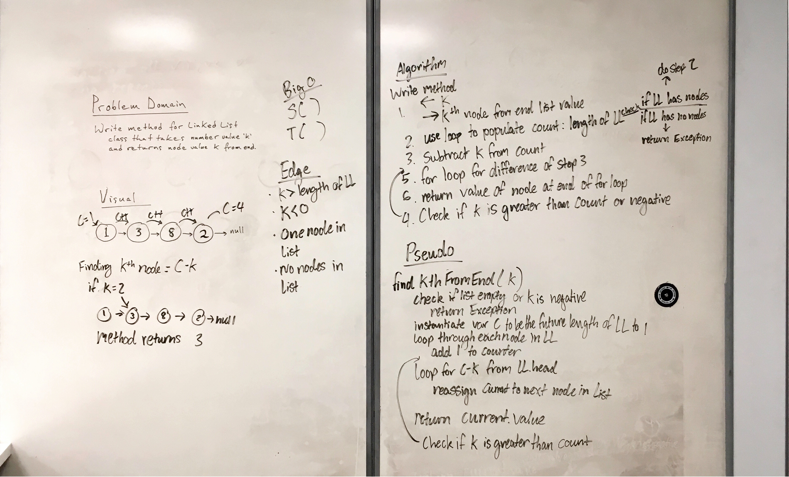

# Singly Linked List
*Author: Andrew Curtis*

## Challenge

I wrote a console app in C# that implements a singly linked list based on two classes: 

* `Node` class: has properties for the value stored in the node and a pointer to the next node
* `LinkedList` class: includes a `Head` property (of type `Node`) and several methods. 

Methods on my `LinkedList` class include:

1. `Insert()`: takes an integer as an argument and adds a new node with that value to the head of the list with an O(1) time performance.

2. `Includes()`: takes an integer as an argument and returns a boolean result depending on whether that value exists as a node's value anywhere within the list.

3. `Print()`: takes no arguments and returns a collection all of the current node values in the linked list.

4. `Append()`: takes an integer as an argument and adds new node with that value to the end of the linked list.

5. `InsertBefore()`: takes two integers as arguments and adds a new node whose value is the second integer argument to the list *before* the node whose value is the first integer argument. Returns a boolean result depending on success of insertion. 

6. `InsertAfter()`: takes two integers as arguments and adds a new node whose value is the second integer argument to the list *after* the node whose value is the first integer argument. Returns a boolean result depending on success of insertion.

7. `GetKthNodeFromEnd()`: takes an integer argument *k* and returns the *k*th node from the end of the list. 

8. `IsCircular()`: takes no arguments, returns a boolean result depending on whether the linked list is circular, i.e. whether it has a node (by definition, the last node) that refers to some previous node in the list.

## Approach & Efficiency

I implemented this project as a minimal approach to creating a singly linked list with a few useful methods available to it. 

#### Time and Space Complexity Analysis

* `Insert()` method
    * Time: O(1)
    * Space: O(1)
* `Includes()` method 
    * Time: O(n)
    * Space: O(1)
* `Print()` method 
    * Time: O(n)
    * Space: O(1)
* `Append()` method 
    * Time: O(n)
    * Space: O(1)
* `InsertBefore()` method 
    * Time: O(n)
    * Space: O(1)
* `InsertAfter()` method 
    * Time: O(n)
    * Space: O(1)
* `GetKthValueFromEnd()` method
    * Time: O(n)
    * Space: O(1)
* `IsCircular()` method
	* Time: O(n)
	* Space: O(1)

## API

#### `public class LList` 

The `LList` class includes public properties `Head` and `Current` for the nodes in the linked list. It also includes the following public methods: 

1. `Insert()`: Takes `int`-type argument "value," returns `void`. Inserts new node at _beginning_ of linked list.
2. `Includes()`: Takes `int`-type argument "value," returns `bool`. Tests whether linked list includes any instances of the specified value.
3. `Print()`: Takes no arguments, returns integer array (`int[]`) containing values of all nodes in the linked list.
4. `Append()`: Takes `int`-type argument "value," returns `void`. Adds new node to end of list.
5. `InsertBefore()`: Takes two `int`-type arguments "existingNodeValue" and "newNodeValue," returns `bool`. Inserts new node before specified node.
6. `InsertAfter()`: Takes two `int`-type arguments "existingNodeValue" and "newNodeValue," returns `bool`. Inserts new node after specified node.
7. `GetKthNodeFromEnd()`: Takes `int`-type argument "k" and returns node at *k*th position from end of list.
8. `IsCircular()`: Takes no arguments, returns boolean.

#### `public class Node` 

The `Node` class includes public Node properties for `Value` (type `int`) and `Value` (type `Node`).

## Ideas for Future Extension

* Convert type to generic (`<T>`)

## Change Log

#### `v1.1`
* `2019-03-25`: Added Node and LList classes and methods Insert(), Includes(), and Print() and corresponding unit tests.

#### `v1.2`
* `2019-03-26`: Added Append(), InsertBefore(), InsertAfter() methods and corresponding unit tests.

#### `v1.3`
* `2019-03-27`: Added GetKthNodeFromEnd() method and corresponding unit tests.

#### `v1.4`
* `2019-03-28`: Fixed failing unit test by adding logic to handle *k* value input of 0.

#### `v1.4`
* `2019-05-03`: Added `IsCircular()` method.

## Initial Whiteboard Planning for Linked List Methods

### Insertion Methods

### Get *k*th Node from End

